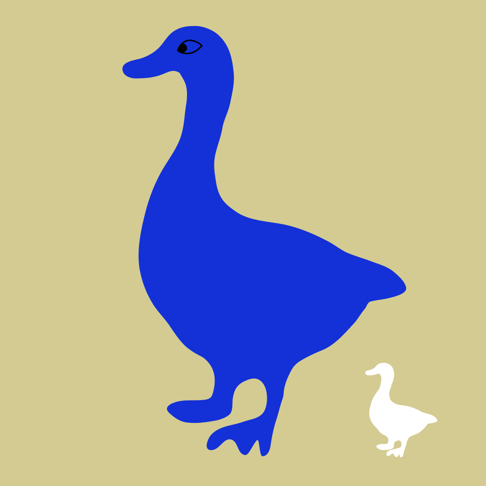

# Honk Portal

### The goose cries like Honk Honk!

https://buildspace.so/p/build-solidity-web3-app

위 튜토리얼을 기반으로 일부 기능을 추가하여 완성했습니다.

## 추가된 기능

1. 유저가 닉네임을 직접 등록할 수 있습니다. 닉네임은 변경 가능합니다.
2. 전체 Honk의 수와, 각 유저 별로 얼마나 Honk 했는지 확인할 수 있습니다.

이더리움 테스트넷 Rinkeby에 배포했습니다. 이더스캔 링크는 [여기](https://rinkeby.etherscan.io/address/0x74Cf0e36f5A757Ce4bA68425bc4d74DE145A54e8)에서 확인 가능합니다.

컨트랙트는 [여기](https://github.com/syjn99/honk-portal-contract)를 참고해주세요.

최종적으로 완성된 페이지는 [여기](https://syjn99.github.io/honk-portal-frontend/) 에서 확인 가능합니다.
